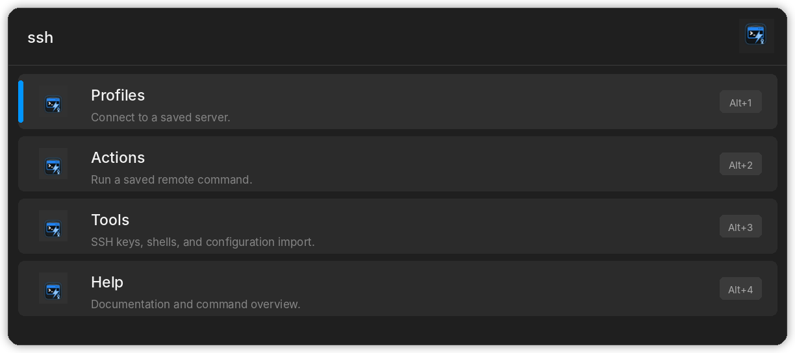
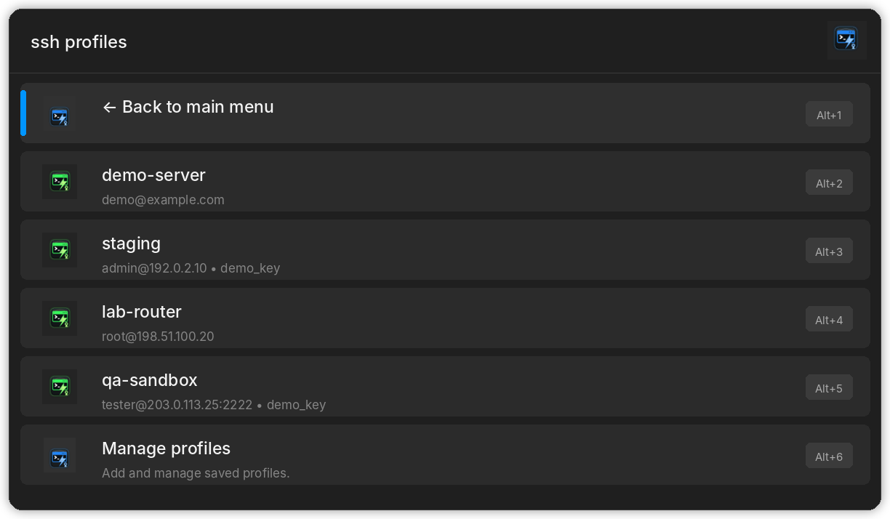
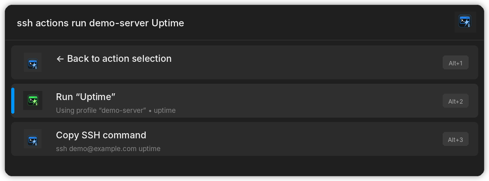

# QuickSSH — Flow Launcher Plugin

[](https://github.com/Vaso73/Flow.Launcher.Plugin.QuickSSH/releases/latest)
[](https://www.flowlauncher.com/)
[](LICENSE)

QuickSSH is a Flow Launcher plugin for connecting to saved SSH and SCP profiles, running reusable remote actions, managing SSH keys, importing OpenSSH configuration, and choosing custom terminal shells.

Type `ssh` to open a focused menu with **Profiles**, **Actions**, **Tools**, and **Help**.



## Highlights

- Guided SSH profile setup with server, port, and authentication steps
- Full SSH/SCP command support for tunnels, ProxyJump, remote commands, and file transfers
- Reusable remote actions with mandatory review and confirmation before execution
- SSH key registration, generation, discovery, clipboard helpers, and public-key installation
- Human-readable profile export/import in an SSH-config-like format
- Portable-aware storage inside the Flow Launcher plugin settings directory
- Custom terminal shells with fail-closed launch behavior
- Accent-insensitive fuzzy search and localized navigation
- English, German, Spanish, French, Polish, Russian, and Slovak interfaces

## Installation

### Flow Launcher Plugin Store

1. Open Flow Launcher.
2. Type `pm install QuickSSH`.
3. Install the plugin and restart Flow Launcher when prompted.
4. Type `ssh`.

### Manual installation

1. Download `QuickSSH.zip` from the [latest release](https://github.com/Vaso73/Flow.Launcher.Plugin.QuickSSH/releases/latest).
2. Extract it as a single plugin folder inside Flow Launcher's user plugin directory.
3. Restart Flow Launcher.
4. Type `ssh`.

## Requirements

- Windows
- [Flow Launcher](https://www.flowlauncher.com/)
- OpenSSH Client (`ssh.exe`) available in `PATH`
- `ssh-keygen` only when generating a new keypair

## Quick start

| Command | Purpose |
|---|---|
| `ssh` | Open the main QuickSSH menu |
| `ssh profiles` | Browse, search, connect, or manage saved profiles |
| `ssh actions` | Run or manage reusable remote commands |
| `ssh tools` | Open SSH keys, shell, and configuration tools |
| `ssh keys` | Use or manage SSH key aliases |
| `ssh shell` | Select or manage the terminal shell |
| `ssh config` | Import hosts from `~/.ssh/config` |
| `ssh help` | Open this documentation |
| `ssh user@example.com` | Start a one-time SSH connection |
| `ssh -p 2222 user@example.com` | Start a one-time connection on another port |
| `ssh -i "~/.ssh/private_key" user@example.com` | Start a one-time connection with an identity file |

QuickSSH commands remain in English in every localized interface. Press **Enter** on menu rows to navigate or perform the displayed action.

## Profiles

Profiles store structured SSH or SCP connection settings. The default guided flow asks for:

1. a profile name,
2. `user@host` or `host`,
3. port `22` or another value from `1` to `65535`,
4. a saved private key, or SSH agent/configuration.

Port `22` is treated as the default and is not stored explicitly. A selected identity file must exist and be recognized by content as a private SSH key. Public keys are rejected even when the file name does not end in `.pub`.



Common examples:

```text
ssh profiles add demo-server demo@example.com
ssh profiles add staging admin@192.0.2.10
ssh profiles add custom-port tester@203.0.113.25
```

For tunnels, SCP, ProxyJump, remote commands, or other advanced options, use the full-command path:

```text
ssh profiles add staging ssh -p 2222 admin@192.0.2.10
ssh profiles add production ssh -i "~/.ssh/private_key" -o IdentitiesOnly=yes deploy@example.com
ssh profiles add tunnel ssh -L 8443:127.0.0.1:443 user@example.com
ssh profiles add internal ssh -J bastion.example.com user@192.0.2.20
ssh profiles add upload scp "C:\example\index.html" user@example.com:/var/www/html/index.html
```

**Manage profiles** groups the regular maintenance actions:

- add,
- rename,
- copy SSH command,
- export,
- import,
- remove.

Removal requires confirmation. Rename and add operations never silently overwrite an existing name.

### Export and import

`ssh profiles export` writes a human-readable `.sshconfig` file to the plugin data directory.

`ssh profiles import` accepts:

- `.sshconfig` exports,
- legacy `.json` profile dictionaries for migration.

Before importing, QuickSSH creates `profiles.json.import.bak` next to the active database. Existing profile names are skipped rather than overwritten. The result reports imported and skipped counts, and a failed save restores both the previous file and the in-memory state.

## Remote actions

Actions are named, reusable single-line commands such as:

```text
hostname
uptime
systemctl status nginx
```

The normal flow is:

1. choose a saved action,
2. choose an SSH profile,
3. review the action and generated SSH command,
4. run it or copy the command.



Every action execution requires explicit confirmation. QuickSSH does not support disabling confirmation per action. SCP profiles cannot run remote actions.

Action names can be added, renamed, and removed under **Manage actions**. Action text must be a single line. Null bytes, line breaks, and recognizable private-key payload markers are rejected.

> QuickSSH executes user-provided remote commands as entered. Review every command and never store passwords, tokens, private keys, or other secrets in an action.

## SSH keys

QuickSSH stores key aliases and file metadata, never private-key content.

Saved key lists identify private and public keys from file content using distinct icons and text labels. Rename and remove views preserve the key type while adding an operation-specific indicator. Missing or unrecognized key files are shown as a fail-closed error state.

Available operations include:

- register an existing private key,
- generate an Ed25519 or RSA 4096 keypair,
- scan `~/.ssh` for existing private keys,
- rename or remove a saved alias,
- copy a private-key path,
- copy public-key content,
- install a public key on a remote Linux host.

Generated keypairs are created non-interactively without a passphrase. QuickSSH verifies that both private and public files exist before registering the new key.

Removing a saved key removes only the QuickSSH entry. The key files remain unchanged.

Public-key installation appends the key to `~/.ssh/authorized_keys` only when it is not already present. It does not transmit private-key content and does not modify `sshd_config`.

## Shells

QuickSSH uses `cmd.exe` when no custom shell is selected. You can register and select another executable, including optional arguments:

```text
ssh shell add PowerShell pwsh.exe -NoLogo
ssh shell add GitBash "C:\Program Files\Git\bin\bash.exe" --login -i -c
ssh shell add WSL wsl.exe --
ssh shell manage
```

Quoted executable paths are supported.

A selected custom shell is exclusive. When its definition is invalid, the executable is missing, or startup fails, QuickSSH shows an error and does not retry the command through `cmd.exe` or another shell. Deselect the custom shell to return to the default.

## SSH configuration import

`ssh config` imports supported hosts from `~/.ssh/config`.

Supported fields include:

- `HostName`
- `User`
- `Port`
- `IdentityFile`
- `IdentitiesOnly`
- `LocalForward`
- `RemoteForward`
- `DynamicForward`
- `ProxyJump`
- `ProxyCommand`

Wildcard entries such as `Host *` are skipped. Existing profile names are preserved.

## Data and portability

QuickSSH stores `profiles.json` in the Flow Launcher plugin settings directory. The database contains:

- SSH/SCP profiles,
- reusable actions,
- custom shells and the selected shell,
- SSH key aliases and metadata.

Installed and portable Flow Launcher environments therefore keep QuickSSH data in their own settings tree. When the new database does not yet exist, QuickSSH can copy a legacy `~/.ssh/profiles.json` once into the active plugin settings directory.

Database writes are atomic. Export and import files are stored in the plugin's `data` directory.

## Search and navigation

- Bare `ssh` shows **Profiles**, **Actions**, **Tools**, and **Help**.
- **Tools** groups SSH keys, shell selection, and SSH config import.
- Direct expert commands such as `ssh keys`, `ssh shell`, and `ssh config` remain available.
- Saved profiles and actions can be filtered by name or displayed text.
- Search is accent-insensitive and supports fuzzy matching.
- Every submenu starts with a **Back** row.
- Menu icons use consistent semantics: green for saved/run/add operations, orange for rename/edit, red for remove/errors, and blue for navigation or neutral operations.

## Command reference

<details>
<summary>Profiles</summary>

| Command | Purpose |
|---|---|
| `ssh profiles [filter]` | Browse or filter saved profiles |
| `ssh profiles add` | Open guided profile creation |
| `ssh profiles manage` | Open profile management |
| `ssh profiles rename` | Rename a profile |
| `ssh profiles copy` | Copy a generated SSH/SCP command |
| `ssh profiles export` | Export profiles to `.sshconfig` |
| `ssh profiles import` | Import `.sshconfig` or legacy `.json` profiles |
| `ssh profiles remove` | Select and confirm profile removal |

</details>

<details>
<summary>Actions</summary>

| Command | Purpose |
|---|---|
| `ssh actions [filter]` | Browse or filter saved actions |
| `ssh actions add` | Save a new single-line remote command |
| `ssh actions manage` | Open action management |
| `ssh actions rename` | Rename an action |
| `ssh actions remove` | Select and confirm action removal |
| `ssh actions run` | Compatibility route: profile first, then action |

</details>

<details>
<summary>SSH keys</summary>

| Command | Purpose |
|---|---|
| `ssh keys` | Browse saved keys and key operations |
| `ssh keys install` | Install a selected public key remotely |
| `ssh keys manage` | Open key management |
| `ssh keys add` | Register an existing private key |
| `ssh keys generate` | Generate and register a new keypair |
| `ssh keys scan` | Find private-key candidates in `~/.ssh` |
| `ssh keys rename` | Rename a key alias |
| `ssh keys copy-path` | Copy a private-key path |
| `ssh keys copy-pub` | Copy public-key content |
| `ssh keys remove` | Remove only the saved alias |

</details>

<details>
<summary>Shell and tools</summary>

| Command | Purpose |
|---|---|
| `ssh tools` | Open keys, shell, and configuration tools |
| `ssh shell` | Select a saved shell |
| `ssh shell manage` | Open shell management |
| `ssh shell add` | Register a shell executable and optional arguments |
| `ssh shell remove` | Remove a saved shell entry |
| `ssh config` | Import `~/.ssh/config` |
| `ssh help` | Open documentation |

</details>

## Languages

- English
- German
- Spanish
- French
- Polish
- Russian
- Slovak

Flow Launcher selects the matching interface language from the current locale.

## Troubleshooting

### OpenSSH client not found

Install the Windows OpenSSH Client optional feature and confirm that `ssh.exe` is available in `PATH`.

### A key cannot be selected for a profile

QuickSSH accepts only existing files recognized as private SSH keys. Select the corresponding private key rather than a `.pub` file.

### A custom shell does not start

Verify the executable path and arguments. QuickSSH deliberately does not fall back to another shell after a selected-shell failure.

### Import files are not listed

Place `.sshconfig` or legacy `.json` files in the QuickSSH plugin `data` directory, then reopen `ssh profiles import`.

### Icons are blank after a manual replacement

Restart Flow Launcher so it reloads the plugin assets.

## Contributing

Issues and pull requests are welcome. User-facing behavior changes should include corresponding public README updates.

## License

QuickSSH is released under the [MIT License](LICENSE).

QuickSSH was inspired by [Melv1no/Flow.Launcher.Plugin.easyssh](https://github.com/Melv1no/Flow.Launcher.Plugin.easyssh).
